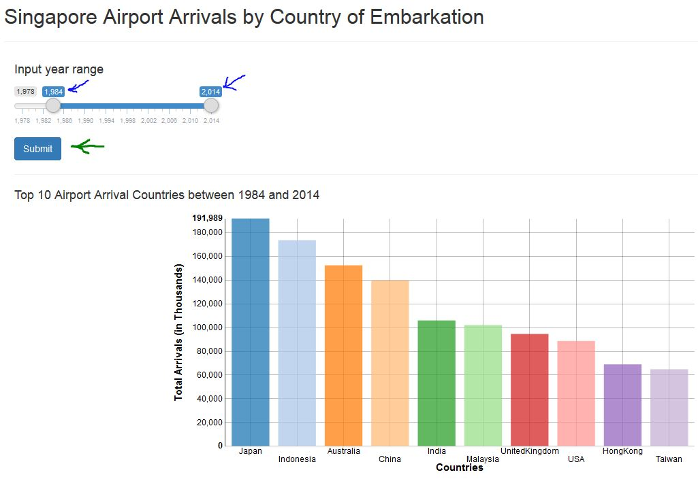
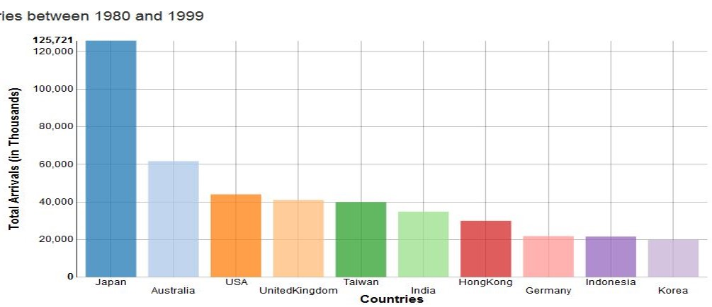
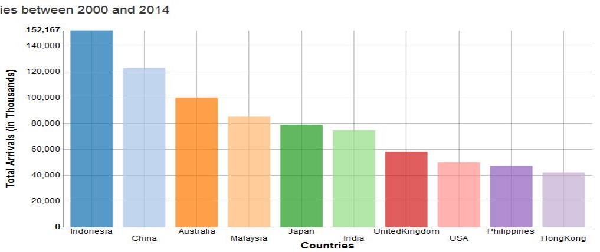

## Usage Instruction

The Data product can be accessed from the following [link](https://crusainte.shinyapps.io/ShinyApp).

After opening the webpage for the Data Product, you would be able to drag the slider to define the
range of year for which will be used in plotting the chart of top 10 nationality of arrivals. 

Pressing on the submit button after defining the year range will update and plot the chart with
the year range input.

    

---

## Trend Analysis

Between the 1980 to 1999, majority of the airport arrivals are from Japan and Australia. This has changed
tremedously between 2000 to 2014 where the majority are now made up of arrivals from Indonesia and China.

---

## Further Improvements

I will be building on the Data Product to show more dimensions and hopefully predict
the Top country of arrival for the upcoming year.
